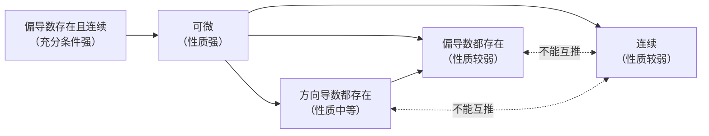

# 多元微分

## 一、多元函数极限与连续

### 二重极限
$$\lim_{(x,y) \to (x_0,y_0)} f(x,y) = A$$
要求**沿任意路径**趋近，极限都存在且相等

**证明极限不存在**：找两条不同路径（直线或抛物线）或选极坐标，极限值不同

### 连续

多元函数在某点连续：二重极限存在且并且极限值**恰好等于该点的函数值**

$$\lim_{(x,y) \to (x_0,y_0)} f(x,y) = f(x_0,y_0)$$

### 闭区间上连续

若 $f(x,y)$ 在区域 $D$ 内每个点都连续，则称 $f(x,y)$ 在区域 $D$ 内连续

最值定理：若 $f(x,y)$ 在区域 $D$ 内连续，则 $f(x,y)$ 在区域 $D$ 内存在最大值和最小值

有界定理：若 $f(x,y)$ 在区域 $D$ 内连续，则 $f(x,y)$ 在区域 $D$ 有界

介值定理：若 $f(x,y)$ 在区域 $D$ 内连续，最大值为 $M$ ，最小值为 $m$ ，则对任意 $m \le z \le M$ ，区域 $D$ 存在一点 $(a,b)$ 使得 $f(a,b) = z$

---

## 二、偏导数与方向导数

### 偏导数的定义

$$f_x(x_0,y_0) = \lim_{\Delta x \to 0} \frac{f(x_0+\Delta x, y_0) - f(x_0,y_0)}{\Delta x}$$
$$f_y(x_0,y_0) = \lim_{\Delta y \to 0} \frac{f(x_0, y_0+\Delta y) - f(x_0,y_0)}{\Delta y}$$

### 高阶偏导数
$$f_{xx} = \frac{\partial^2 f}{\partial x^2}, \quad f_{xy} = \frac{\partial^2 f}{\partial x \partial y}$$

### **二阶混合偏导定理**

$f_{xy}$ 和 $f_{yx}$ 在某点的邻域内都存在并且在该点都连续则两者相等

### 方向导数的定义

沿每条从该点出发的射线，二元函数的变化率，偏导数是方向导数在两个特殊方向上的特例
\[
D_{\mathbf u}f(x_0,y_0)
=
\lim_{t\to 0^+}
\frac{f(x_0+t\cos\alpha,\ y_0+t\cos\beta)-f(x_0,y_0)}{t}
\]

---

## 三、全微分

### 多元函数可导的定义？

多元函数没有在某点可导的概念，被下面的可微取代

### 可微的定义

多元函数在某点的全增量（实际改变量）满足
$$
\Delta z = A \Delta x + B \Delta y + o\left(\sqrt{(\Delta x)^2 + (\Delta y)^2}\right)
$$

$$
\lim_{\substack{\Delta x \to 0 \\ \Delta y \to 0}} 
\frac{\Delta z - (f_x \Delta x + f_y \Delta y)}{\sqrt{(\Delta x)^2 + (\Delta y)^2}} = 0
$$

时，称全微分（线性近似改变量） $dz = A dx + B dy$ 存在，即多元函数在该点可微

### 可微的必要条件
- 偏导数存在：$A = f_x$，$B = f_y$
- 二元函数连续

### 可微的充分条件
两个偏导数都连续 $\Rightarrow$ 可微

### 判定可微的步骤
1. 求两个偏导数 $f_x(x_0,y_0)$，$f_y(x_0,y_0)$
2. 用可微的定义验证：$\lim_{(\Delta x,\Delta y) \to (0,0)} \frac{\Delta z - f_x\Delta x - f_y\Delta y}{\sqrt{(\Delta x)^2+(\Delta y)^2}} = 0$

### 关系总结

- 两个偏导数都存在且连续 $\Rightarrow$ 可微
- 可微 $\Rightarrow$ 偏导数存在
- 可微 $\Rightarrow$ 二元函数连续
- 偏导数存在 $\nRightarrow$ 可微
- 偏导数存在 $\nRightarrow$ 连续
- 连续 $\nRightarrow$ 偏导数存在

---

## 四、复合函数求导（链式法则）

### 全导数

设

\[
z=f(u,v),\qquad u=u(t),\qquad v=v(t)
\]

则 \(z\) 最终是 \(t\) 的一元函数，求导用全导数：

\[
\frac{dz}{dt}
=
\frac{\partial f}{\partial u}\frac{du}{dt}
+
\frac{\partial f}{\partial v}\frac{dv}{dt}
\]

注意：

- 这里 \(z\) 最终只依赖 \(t\)，所以用 \(\frac{dz}{dt}\)，不是 \(\frac{\partial z}{\partial t}\)。
- \(\frac{\partial f}{\partial u}\)、\(\frac{\partial f}{\partial v}\) 仍然是 \(u,v\) 的函数。

---

### 二元复合函数的一阶偏导

设

\[
z=f(u,v),\qquad u=u(x,y),\qquad v=v(x,y)
\]

则 \(z\) 通过 \(u,v\) 依赖于 \(x,y\)。

#### 对 \(x\) 的一阶偏导

\[
\frac{\partial z}{\partial x}
=
\frac{\partial f}{\partial u}\frac{\partial u}{\partial x}
+
\frac{\partial f}{\partial v}\frac{\partial v}{\partial x}
\]

#### 对 \(y\) 的一阶偏导

\[
\frac{\partial z}{\partial y}
=
\frac{\partial f}{\partial u}\frac{\partial u}{\partial y}
+
\frac{\partial f}{\partial v}\frac{\partial v}{\partial y}
\]

---

### 二阶偏导

> **一阶偏导中的 \(\frac{\partial f}{\partial u}\)、\(\frac{\partial f}{\partial v}\) 仍然是 \(u,v\) 的函数，而 \(u,v\) 又是 \(x,y\) 的函数，所以再求二阶导时必须继续用链式法则。**

也就是说：

\[
\frac{\partial f}{\partial u}
=
\frac{\partial f}{\partial u}(u,v),
\qquad
\frac{\partial f}{\partial v}
=
\frac{\partial f}{\partial v}(u,v)
\]

它们不是常数，不能直接当常数处理。

因此：

\[
\frac{\partial}{\partial x}
\left(
\frac{\partial f}{\partial u}
\right)
=
\frac{\partial^2 f}{\partial u^2}\frac{\partial u}{\partial x}
+
\frac{\partial^2 f}{\partial u\partial v}\frac{\partial v}{\partial x}
\]

\[
\frac{\partial}{\partial x}
\left(
\frac{\partial f}{\partial v}
\right)
=
\frac{\partial^2 f}{\partial v\partial u}\frac{\partial u}{\partial x}
+
\frac{\partial^2 f}{\partial v^2}\frac{\partial v}{\partial x}
\]

同理：

\[
\frac{\partial}{\partial y}
\left(
\frac{\partial f}{\partial u}
\right)
=
\frac{\partial^2 f}{\partial u^2}\frac{\partial u}{\partial y}
+
\frac{\partial^2 f}{\partial u\partial v}\frac{\partial v}{\partial y}
\]

\[
\frac{\partial}{\partial y}
\left(
\frac{\partial f}{\partial v}
\right)
=
\frac{\partial^2 f}{\partial v\partial u}\frac{\partial u}{\partial y}
+
\frac{\partial^2 f}{\partial v^2}\frac{\partial v}{\partial y}
\]

一般假设二阶混合偏导连续，所以：

\[
\frac{\partial^2 f}{\partial u\partial v}
=
\frac{\partial^2 f}{\partial v\partial u}
\]

#### 1. 对 \(x\) 求二阶偏导

先写：

\[
\frac{\partial z}{\partial x}
=
\frac{\partial f}{\partial u}\frac{\partial u}{\partial x}
+
\frac{\partial f}{\partial v}\frac{\partial v}{\partial x}
\]

再对 \(x\) 求偏导：

\[
\frac{\partial^2 z}{\partial x^2}
=
\frac{\partial (\frac{\partial z}{\partial x})}{\partial x}
=
\frac{\partial}{\partial x}
\left(
\frac{\partial f}{\partial u}
\right)
\frac{\partial u}{\partial x}
+
\frac{\partial f}{\partial u}
\frac{\partial^2 u}{\partial x^2}
+
\frac{\partial}{\partial x}
\left(
\frac{\partial f}{\partial v}
\right)
\frac{\partial v}{\partial x}
+
\frac{\partial f}{\partial v}
\frac{\partial^2 v}{\partial x^2}
\]

其中因为 \(\frac{\partial f}{\partial u}\)、\(\frac{\partial f}{\partial v}\) 仍然是 \(u,v\) 的函数，所以：

\[
\frac{\partial}{\partial x}
\left(
\frac{\partial f}{\partial u}
\right)
=
\frac{\partial^2 f}{\partial u^2}\frac{\partial u}{\partial x}
+
\frac{\partial^2 f}{\partial u\partial v}\frac{\partial v}{\partial x}
\]

\[
\frac{\partial}{\partial x}
\left(
\frac{\partial f}{\partial v}
\right)
=
\frac{\partial^2 f}{\partial v\partial u}\frac{\partial u}{\partial x}
+
\frac{\partial^2 f}{\partial v^2}\frac{\partial v}{\partial x}
\]

所以：

\[
\begin{aligned}
\frac{\partial^2 z}{\partial x^2}
={}&
\frac{\partial^2 f}{\partial u^2}
\left(
\frac{\partial u}{\partial x}
\right)^2
+
2
\frac{\partial^2 f}{\partial u\partial v}
\frac{\partial u}{\partial x}
\frac{\partial v}{\partial x}
+
\frac{\partial^2 f}{\partial v^2}
\left(
\frac{\partial v}{\partial x}
\right)^2
\\
&+
\frac{\partial f}{\partial u}
\frac{\partial^2 u}{\partial x^2}
+
\frac{\partial f}{\partial v}
\frac{\partial^2 v}{\partial x^2}
\end{aligned}
\]

---

#### 2. 对 \(y\) 求二阶偏导

同理：

\[
\begin{aligned}
\frac{\partial^2 z}{\partial y^2}
={}&
\frac{\partial^2 f}{\partial u^2}
\left(
\frac{\partial u}{\partial y}
\right)^2
+
2
\frac{\partial^2 f}{\partial u\partial v}
\frac{\partial u}{\partial y}
\frac{\partial v}{\partial y}
+
\frac{\partial^2 f}{\partial v^2}
\left(
\frac{\partial v}{\partial y}
\right)^2
\\
&+
\frac{\partial f}{\partial u}
\frac{\partial^2 u}{\partial y^2}
+
\frac{\partial f}{\partial v}
\frac{\partial^2 v}{\partial y^2}
\end{aligned}
\]

---

#### 3. 混合偏导

先写：

\[
\frac{\partial z}{\partial x}
=
\frac{\partial f}{\partial u}\frac{\partial u}{\partial x}
+
\frac{\partial f}{\partial v}\frac{\partial v}{\partial x}
\]

再对 \(y\) 求偏导：

\[
\frac{\partial^2 z}{\partial y\partial x}
=
\frac{\partial}{\partial y}
\left(
\frac{\partial f}{\partial u}
\right)
\frac{\partial u}{\partial x}
+
\frac{\partial f}{\partial u}
\frac{\partial^2 u}{\partial y\partial x}
+
\frac{\partial}{\partial y}
\left(
\frac{\partial f}{\partial v}
\right)
\frac{\partial v}{\partial x}
+
\frac{\partial f}{\partial v}
\frac{\partial^2 v}{\partial y\partial x}
\]

其中：

\[
\frac{\partial}{\partial y}
\left(
\frac{\partial f}{\partial u}
\right)
=
\frac{\partial^2 f}{\partial u^2}\frac{\partial u}{\partial y}
+
\frac{\partial^2 f}{\partial u\partial v}\frac{\partial v}{\partial y}
\]

\[
\frac{\partial}{\partial y}
\left(
\frac{\partial f}{\partial v}
\right)
=
\frac{\partial^2 f}{\partial v\partial u}\frac{\partial u}{\partial y}
+
\frac{\partial^2 f}{\partial v^2}\frac{\partial v}{\partial y}
\]

所以：

\[
\begin{aligned}
\frac{\partial^2 z}{\partial y\partial x}
={}&
\frac{\partial^2 f}{\partial u^2}
\frac{\partial u}{\partial x}
\frac{\partial u}{\partial y}
+
\frac{\partial^2 f}{\partial u\partial v}
\left(
\frac{\partial u}{\partial x}
\frac{\partial v}{\partial y}
+
\frac{\partial v}{\partial x}
\frac{\partial u}{\partial y}
\right)
+
\frac{\partial^2 f}{\partial v^2}
\frac{\partial v}{\partial x}
\frac{\partial v}{\partial y}
\\
&+
\frac{\partial f}{\partial u}
\frac{\partial^2 u}{\partial y\partial x}
+
\frac{\partial f}{\partial v}
\frac{\partial^2 v}{\partial y\partial x}
\end{aligned}
\]

若二阶偏导连续，则：

\[
\frac{\partial^2 z}{\partial y\partial x}
=
\frac{\partial^2 z}{\partial x\partial y}
\]

---

## 隐函数求导

### 一元隐函数
$F(x,y)=0$，则 $\frac{dy}{dx} = -\frac{F_x}{F_y}$

### 二元隐函数
$F(x,y,z)=0$，则 $\frac{\partial z}{\partial x} = -\frac{F_x}{F_z}$，$\frac{\partial z}{\partial y} = -\frac{F_y}{F_z}$

---

## 多元函数微分学应用

### 极值
- **必要条件**：$f_x=0$，$f_y=0$（驻点）
- **充分条件**：设 $A=f_{xx}$，$B=f_{xy}$，$C=f_{yy}$
  - $AC-B^2 > 0$：极值（$A>0$ 极小，$A<0$ 极大）
  - $AC-B^2 < 0$：非极值
  - $AC-B^2 = 0$：需进一步判断

### 条件极值（拉格朗日乘数法）
求 $z=f(x,y)$ 在 $\varphi(x,y)=0$ 下的极值
构造 $L = f(x,y) + \lambda \varphi(x,y)$
解方程组：
$$\begin{cases} L_x = f_x + \lambda \varphi_x = 0 \\ L_y = f_y + \lambda \varphi_y = 0 \\ \varphi(x,y) = 0 \end{cases}$$

### 方向导数

$$\frac{\partial f}{\partial l} = f_x \cos\alpha + f_y \cos\beta + f_z \cos\gamma$$
其中 $(\cos\alpha, \cos\beta, \cos\gamma)$ 为方向 $l$ 的方向余弦

### 梯度

$$\text{grad } f = \nabla f = (f_x, f_y, f_z)$$

- 方向：函数增长最快的方向
- 模：最大方向导数

### 几何应用

- **空间曲线切线**：$\frac{x-x_0}{x'(t_0)} = \frac{y-y_0}{y'(t_0)} = \frac{z-z_0}{z'(t_0)}$
- **空间曲线法平面**：$x'(t_0)(x-x_0) + y'(t_0)(y-y_0) + z'(t_0)(z-z_0) = 0$
- **曲面切平面**：$F_x(x-x_0) + F_y(y-y_0) + F_z(z-z_0) = 0$
- **曲面法线**：$\frac{x-x_0}{F_x} = \frac{y-y_0}{F_y} = \frac{z-z_0}{F_z}$
