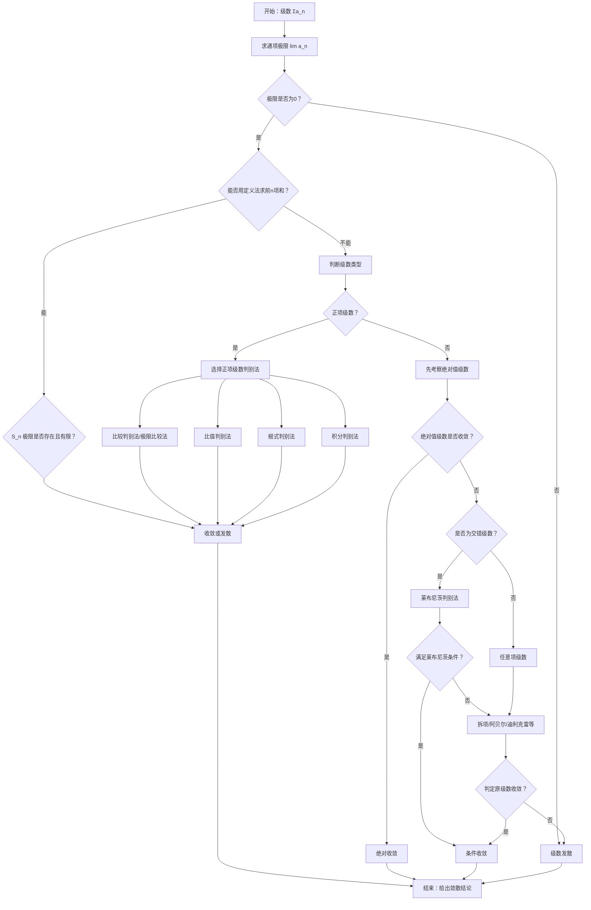

# 级数

### 重要极限

$\lim_{n \to \infty} (1 + \frac{1}{n})^n = e$

$\lim_{n \to \infty} n^{\frac{1}{n}} = 1$

$\lim_{n \to \infty} \frac{(n!)^\frac{1}{n}}{n} = \frac{1}{e}$

### 重要大小关系

$\ln n \ll n^a \ll a^n \ll n! \ll n^n$

$\lim_{n \to \infty} \sqrt[n]{lnx} = 1$

$\lim_{n \to \infty} \sqrt[n]{n^a} = 1$

$\lim_{n \to \infty} \sqrt[n]{a^n} = a$

$\lim_{n \to \infty} \sqrt[n]{n!} = n/e = \infty$

斯特林公式：$n! \approx \sqrt{2\pi n}(\frac{n}{e})^n = n^n\cdot e^{-n}\cdot \sqrt{2\pi n}$ ，可以理解为 $n!$ 和 $n^n$ 大约相差一个**指数增长级别的因子**

$\lim_{n \to \infty} \sqrt[n]{n^n} = n = \infty$

## 具体数项级数

### 定义

**把一个数列的无穷项按顺序用加号连起来得到的表达式**

$$\sum_{n=1}^\infty u_n = \lim_{n \to \infty} S_n, \quad S_n = \sum_{k=1}^n u_k$$

### 收敛的必要条件
若 $\sum u_n$ 收敛，则 $\lim_{n \to \infty} u_n = 0$

**逆否**：$\lim u_n \ne 0 \Rightarrow$ 发散

### 基本性质
1. 去掉、增加或改变有限项不影响敛散性

2. 线性性

   收敛 + 收敛 = 收敛

   收敛 + 发散 = 发散

   发散 + 发散 = 不一定

3. 加括号提升收敛性

   收敛级数加括号后仍收敛

   不收敛的级数加括号后可能收敛，加括号后收敛的级数不一定收敛

4. 加绝对值降低收敛性

   发散级数加上绝对值后仍发散

   收敛级数加绝对值后不一定收敛，加绝对值后收敛的级数一定收敛

### 重要级数（敛散性容易判断）

- **几何级数（等比数列求和）**：$\sum_{n=0}^\infty aq^n$，$|q|<1$ 收敛于 $\frac{a}{1-q}$，$|q| \ge 1$ 发散

- **p 级数（幂数列求和）**：$\sum_{n=1}^\infty \frac{1}{n^p}$，$p>1$ 收敛，$p \le 1$ 发散

  对数p级数：$\sum_{n=1}^\infty \frac{1}{n^p \ln^qn}$，$p>1$ 收敛；p=1，q＞1收敛，q≤1发散； p＜1 发散

  证明方法：积分判别法

- **调和级数**：$\sum_{n=1}^\infty \frac{1}{n}$ 发散

---

## 正项级数收敛判别法

### 收敛的充要条件

**正项级数**收敛等价于前n项和有上界

推论：正项级数收敛→奇数项/偶数项级数均收敛

### 比较判别法

把通项放缩成容易判断级数敛散性的几种重要级数

$0 \le u_n \le v_n$
- $\sum v_n$ 收敛 $\Rightarrow$ $\sum u_n$ 收敛（大收则小收）
- $\sum u_n$ 发散 $\Rightarrow$ $\sum v_n$ 发散（小散则大散）

#### 常用放缩方法

1. 函数不等式： $sinx \le x$ ， $1+x \le e^x$ ， $\frac{x}{x+1} \le ln(1+x) \le x$
2. 基本不等式： $|ab| \le \frac{a^2 + b^2}{2}$
3. 分数放缩

### 比较判别法的极限形式
$$\lim_{n \to \infty} \frac{u_n}{v_n} = l$$
- $0 < l < \infty$：同敛散
- $l=0$：$\sum v_n$ 收敛 $\Rightarrow$ $\sum u_n$ 收敛（大收则小收）
- $l=\infty$：$\sum v_n$ 发散 $\Rightarrow$ $\sum u_n$ 发散（小散则大散）

### 比值判别法（达朗贝尔）

适用通项含n的阶乘

$$\lim_{n \to \infty} \frac{u_{n+1}}{u_n} = \rho$$
- $\rho < 1$：收敛
- $\rho > 1$：发散
- $\rho = 1$：方法失效，用其他方法

### 根值判别法（柯西）

适用通项含n次方

$$\lim_{n \to \infty} \sqrt[n]{u_n} = \rho$$
- $\rho < 1$：收敛
- $\rho > 1$：发散
- $\rho = 1$：方法失效，用其他方法

### 积分判别法
$f(x)$ 单调递减非负，则 $\sum_{n=1}^\infty f(n)$ 与 $\int_1^{+\infty} f(x)dx$ 同敛散

---

## 交错级数

### 莱布尼茨判别法

把通项的符号和绝对值拆开 

$\sum_{n=1}^\infty (-1)^{n-1} u_n$（$u_n > 0$）
- $u_n$ 单调递减
- $\lim_{n \to \infty} u_n = 0$
则级数收敛

如果没有趋于0这个条件会发生什么？

不满足通项极限为0的必要条件。

如果没有单调性这个条件会发生什么？

反例：$a_{2k-1} = \frac{1}{n},a_{2k} = 0,\lim_{n \to \infty} a_n = 0,\sum_{n=1}^\infty (-1)^{n-1} a_n = \sum_{n=1}^\infty \frac{1}{n}发散$

补充：交错级数的奇数项和、偶数项和（正项和、负项和）不一定收敛，得到的收敛结果只是条件收敛

---

## 绝对收敛与条件收敛

- **绝对收敛**：$\sum |u_n|$ 收敛 $\Rightarrow$ $\sum u_n$ 收敛
- **条件收敛**：$\sum u_n$ 收敛但 $\sum |u_n|$ 发散

### 性质

1. 绝对收敛的级数本身一定收敛

2. 绝对收敛的级数所有正项或负项组成的级数均收敛

3. 绝对收敛 ± 绝对收敛 = 绝对收敛

   绝对收敛 ± 条件收敛 = 条件收敛

   条件收敛 ± 条件收敛 = 收敛 

4. 绝对收敛 x 收敛 = 绝对收敛

5. 绝对收敛的级数，其正项级数和负项级数均收敛

6. 条件收敛的级数，其正项级数和负项级数均发散（反证法：两个新级数都是正项级数，若都收敛则原级数绝对收敛；若两个新级数一个收敛一个发散则原级数发散）

## 审敛流程

1. 求通项极限，若不为零则发散

2. 定义法：求前n项和，若能表示出则看其极限是否存在知道敛散

3. 判断级数的类型

4. 若为正项级数，用比较/比值/根式/积分判别法

   若为交错级数或任意项级数，先取绝对值判断是否绝对收敛，若不绝对收敛再用莱布尼茨判别法判断是否条件收敛

---

## 抽象数项级数

通项没有具体表达式，只给出一般形式或满足某些条件的数项级数

### 解题技巧

#### 反证法

#### 常用有特殊性质的级数反例

1. 绝对收敛：$a_n = 0$， $a_n = \frac{1}{n}$

2. 条件收敛：

   $a_n = \frac{(-1)^n}{n}$ 、$a_n = \frac{(-1)^n}{\ln n}$ 奇偶项和发散

   $a_n = \frac{(-1)^n}{\sqrt{n}}$ 本身收敛但平方发散

   $a_n = \frac{(-1)^n}{n\ln n}$， 

3. 发散：

   $a_n = C$

   $a_n = (-1)^n$ 本身发散但奇偶项相加可以收敛

   $a_n = \frac{1}{n}$ 本身发散但相减可收敛

   $a_n = \frac{1}{n\ln n}$

#### 条件反射

级数收敛→通项极限为0→ 通项有界可放缩

级数发散→绝对值级数发散

$a_n$ 单减，交错级数发散→$a_n$极限不为0

正项级数收敛→绝对收敛

两个级数的大小关系→相减构造正项级数

两个正项级数的大小关系→比较审敛法

平方级数的收敛性→基本不等式 $2ab \leq a^2+b^2$

---

## 函数项级数——幂级数

### 定义
$$\sum_{n=0}^\infty a_n (x-x_0)^n$$

x 取具体值时变成数项级数，其本质上是一个含参数的数项级数，并且以 x 为倍数几何增长

反过来一个数项级数也可以转化成幂级数（取特值时）

### 收敛域

收敛点的全体

### 收敛中心

$x = x_0$ 时通项恒为0，必收敛

### 收敛半径
$$\lim_{n \to \infty} \left|\frac{a_{n+1}}{a_n}\right| = \rho \Rightarrow R = \frac{1}{\rho}$$
（$\rho=0$ 时 $R=+\infty$；$\rho=+\infty$ 时 $R=0$）

### 根式爆破法求收敛半径

$\lim_{n \to \infty} (a_n)^\frac{1}{n}x < 1$

> 用根值判别法求收敛半径，得到的是  
> $$
> R=\frac{1}{\limsup |a_n|^{1/n}}
> $$
> 用比值判别法求收敛半径，得到的是  
> $$
> R=\lim\left|\frac{a_n}{a_{n+1}}\right|
> $$
> 当两个极限都存在时，它们相等，所以结果一样。  
> 教材更常用比值判别法，不是因为根值判别法不对，而是因为比值判别法在处理阶乘、连乘等常见系数时通常更方便。  

### 收敛区间
$(x_0-R, x_0+R)$ + 区间端点单独讨论敛散性

### 阿贝尔定理

一点收敛，内部绝对收敛

一点发散，外部发散

推论：

收敛区间内：绝对收敛

收敛区间的端点：收敛发散都有可能

收敛区间外：发散

### 性质
- 可逐项求导
- 可逐项积分
- 收敛半径不变

### 幂级数求和

泰勒展开就是一个幂级数
$$
f(x)=f(x_0)+f'(x_0)(x-x_0)+\frac{f''(x_0)}{2!}(x-x_0)^2+\cdots+\frac{f^{(n)}(x_0)}{n!}(x-x_0)^n+R_n(x) \\
\sum_{n=0}^\infty a_n (x-x_0)^n = \sum_{n=0}^\infty \frac{f^{(n)}(x_0)}{n!}(x-x_0)^n
$$

#### 展和关系（泰勒展开与幂级数求和的对应关系）

1. 等比级数（通项不含分数）

   $\frac{1}{1-x}=1+x+x^2+\cdots=\sum_{n=0}^\infty x^n, \quad x \in (-1, 1)$

   $\frac{1}{1+x}=1-x+x^2-\cdots= \sum_{n=0}^\infty (-1)^n x^n, \quad x \in (-1, 1)$

   $\frac{1}{(1-x)^2}$ 通过 $\frac{1}{1-x}$ 求导可得

   $\frac{2}{(1-x)^3}$ 通过 $\frac{1}{(1-x)^2}$ 求导可得

2. 幂指数正余弦（通项有分数，分母含阶乘）

   $(1+x)^\alpha=1+\alpha x+\frac{\alpha(\alpha-1)}{2!}x^2+\cdots= 1 + \sum_{n=1}^\infty \frac{\alpha(\alpha-1)\cdots(\alpha-n+1)}{n!} x^n, \quad x \in (-1, 1)$

   $e^x=1+x+\frac{x^2}{2!}+\frac{x^3}{3!}+\cdots = \sum_{n=0}^\infty \frac{1}{n!}x^n, \quad x \in (-\infty, +\infty)$

   $e^{-x}=1-x+\frac{x^2}{2!}-\frac{x^3}{3!}+\cdots = \sum_{n=0}^\infty \frac{(-1)^n}{n!}x^n, \quad x \in (-\infty, +\infty)$

   $\frac{e^x+e^{-x}}{2}$

   $\frac{e^x-e^{-x}}{2}$

   $\sin x=x-\frac{x^3}{3!}+\frac{x^5}{5!}-\cdots= \sum_{n=0}^\infty \frac{(-1)^n x^{2n+1}}{(2n+1)!}, \quad x \in (-\infty, +\infty)$

   $\cos x=1-\frac{x^2}{2!}+\frac{x^4}{4!}-\cdots= \sum_{n=0}^\infty \frac{(-1)^n x^{2n}}{(2n)!}, \quad x \in (-\infty, +\infty)$

3. 对数反正切（通项有分数无阶乘）

   $\ln(1+x)=x-\frac{x^2}{2}+\frac{x^3}{3}-\cdots= \sum_{n=1}^\infty \frac{(-1)^{n-1} x^n}{n}, \quad x \in (-1, 1]$

   $\ln(1-x)$

   $\ln\frac{1+x}{1-x}$

   $\arctan x=x-\frac{x^3}{3}+\frac{x^5}{5}-\cdots$

#### 解题技巧

观察题目给的通项，判断（有无分数、阶乘）是哪种类型的函数展开

把题目的通项变形成对应幂级数求和的通项，直接变回函数

先导后积、先积后导、拆项、配凑

#### 和微分方程结合

### 函数展开成幂级数

---

## 傅里叶级数

### 周期为 $2\pi$ 的函数
$$f(x) = \frac{a_0}{2} + \sum_{n=1}^\infty (a_n \cos nx + b_n \sin nx)$$
$$a_n = \frac{1}{\pi} \int_{-\pi}^{\pi} f(x) \cos nx dx$$
$$b_n = \frac{1}{\pi} \int_{-\pi}^{\pi} f(x) \sin nx dx$$

### 周期为 $2l$ 的函数
$$f(x) = \frac{a_0}{2} + \sum_{n=1}^\infty \left(a_n \cos \frac{n\pi x}{l} + b_n \sin \frac{n\pi x}{l}\right)$$
$$a_n = \frac{1}{l} \int_{-l}^{l} f(x) \cos \frac{n\pi x}{l} dx$$
$$b_n = \frac{1}{l} \int_{-l}^{l} f(x) \sin \frac{n\pi x}{l} dx$$

### 狄利克雷收敛定理
- 连续点：收敛于 $f(x)$
- 间断点：收敛于 $\frac{f(x^-)+f(x^+)}{2}$

### 奇偶函数
- **奇函数**：$a_n=0$，只有正弦项（正弦级数）
- **偶函数**：$b_n=0$，只有余弦项（余弦级数）

### 帕塞瓦尔等式
$$\frac{a_0^2}{2} + \sum_{n=1}^\infty (a_n^2 + b_n^2) = \frac{1}{\pi} \int_{-\pi}^{\pi} f^2(x) dx$$
